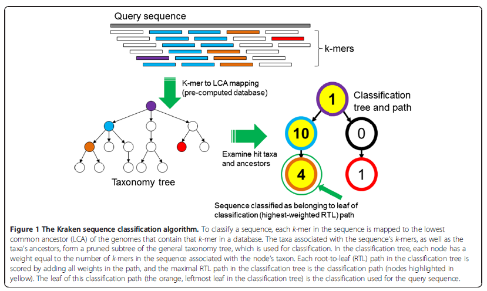
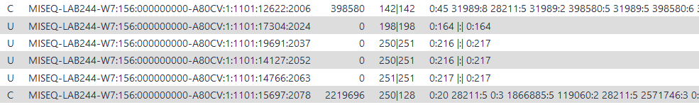
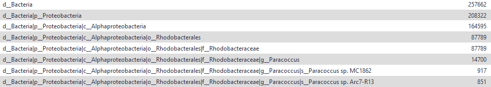

# Taxonomic Assignment Tutorial
---
layout: tutorial_hands_on

title: Taxonomic Assignment with Kraken2
zenodo_link: still needs to be created
questions:
- Which species are present in my sample?
objectives:
- Use Kraken2 to assign taxonomic labels
- Use Krona to visualize results of assignment
time_estimation: 30min
key_points:
- We learned to use Kraken2 to assign taxonomic labels
- We learned to use Krona to understand the results
contributors:
- Sophia

---
# Introduction

Metagenomic samples contain DNA from different organisms at a specific space, where the sample was collected. This space can be soil, water or the human gut for example. Either way, the aim is to find out which organisms coexist in that niche. Therefore, taxonomic assignment is one step of analyzing metagenomics data. It is about identifying the taxon, to which an individual read belongs to. In the end, you derive a list of species that are present in the sample, of which DNA was sequenced and could be classified. In general, this works via comparing reads to a database, which can be done in different ways. For this tutorial, we will use Kraken2, an algorithm that breaks databases as well as reads into k-mers for comparison, to reduce memory consumption and processing time.

  xxx citation

The original algorithm was then developed further to obtain Kraken2, which will be used for this tutorial. The advantages are ... xxx

> ### Agenda
>
> In this tutorial, we will cover:
>
> 1.[TOC]
> 
>
{: .agenda}

# Background on data

The dataset we will use for this tutorial comes from an oasis in the mexican desert called Cuatro Ciénegas, that is studied because of its special environmental conditions. It is paired-end data with JP4D_R1.fastq.gz being the forward reads and JP4D_R1.fastq.gz being the reverse reads. Additionally, the reads have been trimmed using __cutadapt__ (s. xxx tutorial)

# Run Kraken2 for taxonomic assignment
 
For this tutorial, we will use the Standard plus protozoa & fungi (2021) database.

> ###  Hands-on: Assign taxonomic labels with Kraken2
>
> 1.  with the following parameters:
>    - *"Single or paired reads"*: `Paired`
>    - *"Print scientific names instead of just taxids"*: `No`
>    - *"Confidence"*: `0.1`
>    - In *"Create Report"*:
>        - *"Print a report with aggregrate counts/clade to file"*: `Yes`
>        - *"Format report output like Kraken 1's kraken-mpa-report"*: `Yes`
>    - *"Select a Kraken2 database"*: `Standard plus protozoa & fungi (2021)`
>
>    > ###  Comment
>    >
>    > A confidence score of 0.1 means that at least 10% of the k-mers should match entries in the database. This value can be reduced if a less restrictive taxonomic assignation is desired.
>    {: .comment}
>
{: .hands_on}

Kraken2 will create two output files called "Classification" and "Report".

Let's have a look at the classification file. (xxx add image) It has 5 columns:

1. C/U: classified/unclassified
2. Sequence ID
3. Taxonomy ID
4. Length of sequence (read1|read2 for paired reads)
5. indicates LCA mapping of each k-mer in the sequence |:| indicates end of first read, start of second read for paired reads --> example: "n k-mers assigned to taxon xxx"

Let's also have a look at the report file. (xxx add image) It has 2 columns:
1. taxon name grouped into d_domain, p_phylum, c_class, o_order, f_family, g_genus, s_species
2. number of reads assigned to specific taxon

As both files are not very well readable, we will use __Krona__ to visualize the data.

# Analyze taxonomic assigment
 
Once we have assigned the corresponding taxa to each sequence, the next step is to properly visualize the data, for which we will use the __Krona pie chart__ tool (). But first, we need to convert the output generated by Kraken2 so it can be used as an input from the Krona tool. 
 
## Convert output from Kraken2 so it can be used for Krona
 
__Convert Kraken__ tool is designed to translate results of the Kraken metagenomic classifier (see citations below) to the full representation of NCBI taxonomy. It does so by using Taxonomic ID field provided by Kraken. The output of this tool can be directly visualized by the Krona tool.

> ###  Hands-on: Convert Kraken2 Output
>
> 1.  with the following parameters:
>    - *"Choose dataset to convert"*: Classification Output of Kraken2
>    - *"Select a taxonomy database"*: `2022-03-08`
>    - *"Read name"*: `column:2`
>    - *"Taxonomy ID field"*: `column:3`
>
{: .hands_on}

## Visualize the taxonomical classification with Krona
 
__Krona__ allows hierarchical data to be explored with zooming, multi-layered pie charts. With this tool, we can easily visualize the composition of the bacterial communities and compare how the populations of microorganisms are modified according to the conditions of the environment.

> ###  Hands-on: Visualize data with Krona
>
> 1.  with the following parameters:
>    - *"Type of input data"*: `taxonomy`
>    - *"Input file"*: Output file of Convert Kraken
>
{: .hands_on}
 

Let's take a look at the [result](https://usegalaxy.eu/datasets/4838ba20a6d86765e92bccb62d7f6daa/display/?preview=True&dataset=0&node=0&collapse=true&color=false&depth=8&font=11&key=true). Using the search bar we can check if certain taxa are present.

> ###  Questions
>
> How many percent of the bacteria consists of the genus "paracoccus"?
> 
>
> > ###  Solution
> >
> > 6 %.
> 
> {: .solution}
>
{: .question}

# Conclusion
In this tutorial we used Kraken2 to do taxonomic assignment of a metagenomic sample and Krona to visualize the results.  
